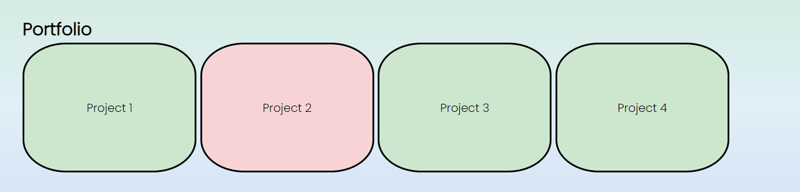

# module-2-assignment

This is a my first version of a portfolio page. It is divided into five main sections: a header with navigation bar, an "About Me" section, a "Skills" section, a "Portfolio" section, and a "Get in Touch" or contact section.

The navigation bar is interactive and allows the user to jump right to the section that interests them.

The contact section links you directly to my LinkedIn, GitHub, e-mail, and phone depending on the link clicked. The phone link works with Skype or a mobile's default calling app.

Although I was unable to capture the mouse in the screenshot, the pink button shows the hover state of the buttons that lead you to different projects that I have done.